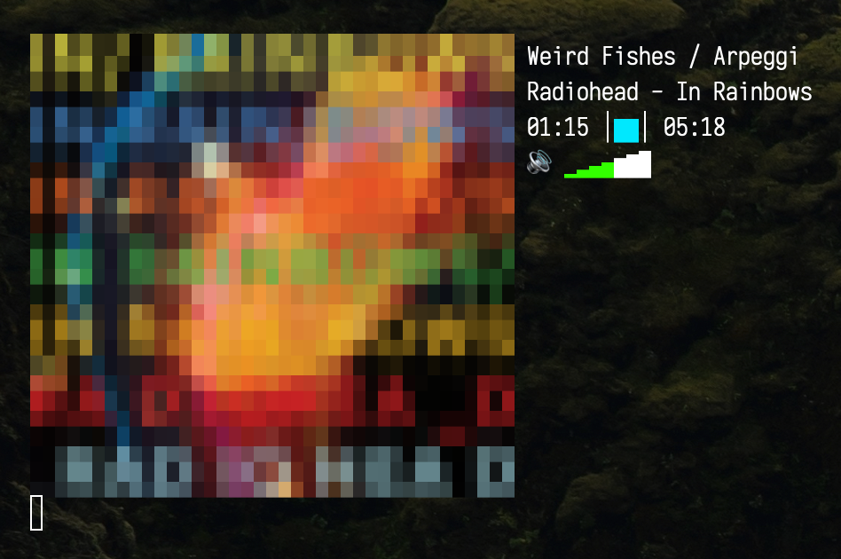

# useful-scripts
### Ready for clipboard → .zshrc / .bashrc (or grab the shell scripts)

If you're interested in using or chaining web services from your command line into larger scripts, see https://github.com/chubin/awesome-console-services. 

#### Contents

*\*nix*

* [YouTube](#YouTube-without-ads "YouTube (without ads)")
* [Dice Roll](#Dice-Roll "Dice Roll")

*macOS Only*

* [Now Playing](#Now-Playing-Apple-Music "Now Playing (Apple Music)")
* [Listen](#Listen-Apple-Music "Listen (Apple Music)")
* [Apple Music Snippets](#Apple-Music-Snippets "Apple Music Snippets")
* [Unlocks](#Unlocks "Unlocks")

#### YouTube (without ads)
Uses DDG w/ params to force YouTube video results from your query, and plays the results you select w/ [MPV](https://github.com/mpv-player/mpv) or continuously queries depending on your subsequent input.  Could easily be reconfigured for use with [Lynx](http://lynx.browser.org), [w3m](http://w3m.sourceforge.net), etc. instead of [ddgr](https://github.com/jarun/ddgr).

Usage: `yt portal 2 longplay`

Dependencies: [ddgr](https://github.com/jarun/ddgr), [MPV](https://github.com/mpv-player/mpv)
```ZSH
yt() {
    #!/bin/sh
    if [ $1 = "q" ]; then
        return
    fi
    query="'$*'"  
    isFound=0
    url=""
    output="$(ddgr -x --np --unsafe site:youtube.com/watch $query)\n"
    clear
    echo "$output"
    echo -ne "Input # or search term (q to quit): "
    read term
    echo "$output" | while read line || [[ -n $line ]];
    do
        if [ $isFound -eq 1 ]; then
            url=$line
            break
        fi
        if [[ $line == *$term". "* ]]; then
            isFound=1
        fi
    done
    if [ $isFound = 0 ]; then
	    yt $term
    else
        mpv $url
	    yt $query
    fi 
}
```

#### Dice Roll
Roll the dice!

Usage: `dice`

```ZSH
dice() {dice=(⚀ ⚁ ⚂ ⚃ ⚄ ⚅); printf ${dice[1 + RANDOM % 6]}; printf '%s\n' " ${dice[1 + RANDOM % 6]}"}
```

#### Now Playing (Apple Music)



Enjoy a Now Playing "widget" from your terminal.  Uses standard Unix tooling/piping, Applescript for interfacing with Apple Music, [Spark](https://github.com/holman/spark) for the progress bar, and [Viu](https://github.com/atanunq/viu) for displaying the album art images.  Pairs well with the additional Apple Music scripts I've included here.

Dependencies: [Spark](https://github.com/holman/spark), [Viu](https://github.com/atanunq/viu), [Doug's album-art.applescript](https://dougscripts.com/itunes/2014/10/save-current-tracks-artwork/)

Configuration: 

* Adjust the `-h` dimension of the album art (the two calls to `viu`) to ensure a square appearance with your terminal emulator's line spacing
* Configure a valid path to album-art.applescript, e.g. ~/Library/Scripts/album-art.applescript

Usage: `np`

```ZSH
np() {
  init=1
  while :
  do
  	vol=$(osascript -e 'get volume settings')
  	duration=$(osascript -e 'tell application "Music" to get {player position} & {duration} of current track')
  	arr=(`echo ${duration}`)
 	 curr=$(cut -d . -f 1 <<< ${arr[-2]})
 	 diff=$(( end - curr ))
 	 bar=$(spark 0 $diff ${arr[-1]})
 	 currMin=$(echo $(( curr / 60 )))
 	 currSec=$(echo $(( curr % 60 )))
  if [ ${#currMin} = 1 ]
  then
  	currMin="0$currMin"
  fi
  if [ ${#currSec} = 1 ]
  then
  	currSec="0$currSec"
  fi
  if (( curr < 2 || init == 1 )); then
  	init=0
 	name=$(osascript -e 'tell application "Music" to get name of current track')
  	name=${name:0:50}
  	artist=$(osascript -e 'tell application "Music" to get artist of current track')
  	artist=${artist:0:50}
  	record=$(osascript -e 'tell application "Music" to get album of current track')
  	record=${record:0:50}
  	end=$(cut -d . -f 1 <<< ${arr[-1]})
  	endMin=$(echo $(( end / 60 )))
  	endSec=$(echo $(( end % 60 )))
  	if [ ${#endMin} = 1 ]
  	then
    		endMin="0$endMin"
  	fi
  	if [ ${#endSec} = 1 ]
  	then
    		endSec="0$endSec"
  	fi
  	rm ~/Library/Scripts/tmp*
  	osascript ~/Library/Scripts/album-art.applescript
  	if [ -f ~/Library/Scripts/tmp.png ]; then
    		art=$(clear; viu ~/Library/Scripts/tmp.png -w 39 -h 13)
  	else 
    		art=$(clear; viu ~/Library/Scripts/tmp.jpg -w 39 -h 13)
  	fi
  fi
  vol=$(echo $(( $(awk -F ':|,' '{print $2}' <<< $vol) / 12)))
  if [ $vol = 0 ]; then
  	volIcon=🔇
  else
  	volIcon=🔊
  fi
  volBars='▁▂▃▄▅▆▇█'
  volBG=${volBars:$vol:-1}
  vol=${volBars:0:$vol}
  paste <(printf %s "$art") <(printf %s "") <(printf %s "") <(printf %s "") <(printf %s "") <(printf '%s\n' "$name" "$artist - $record" "$(echo $currMin:$currSec ⎮'\e[00;36m'${bar:1:1}''${bar:1:1}'\033[0m'⎮ $endMin:$endSec)" "$volIcon $(echo "\e[0;32m$vol\033[0m$volBG")")
  sleep 1
  done
}
```

#### Listen (Apple Music)
Call this script to begin playback of a specified song, album, songs from a specific artist, or songs from a specific playlist.  This is dictated by the flag you pass.  Unfortunately there is no simple way to play a specific album or songs from a specific artist with Applescript, but I was able to modify code shared by a "jccc" [here](https://discussions.apple.com/thread/1053355), which involves creating a temporary playlist.

Configuration: 

* Remove calls to `np` if you don't have my Now Playing script aliased

Usage: `listen -s House of Cards`, `listen -r In Rainbows`, `listen -a Radiohead`, `listen -p Radiohead Essentials`

```ZSH
listen() {
  input=$2
  if [ $1 = "-s" ] 
  then
  	shift
  	osascript -e 'on run argv
    	tell application "Music" to play track (item 1 of argv)
  	end' "$*"
  	np
  elif [ $1 = "-r" ] 
  then
    	shift
    	osascript -e 'on run argv' -e 'tell application "Music"' -e 'if (exists playlist "temp_playlist") then' -e 'delete playlist "temp_playlist"' -e 'end if' -e 'set name of (make new playlist) to "temp_playlist"' -e 'set theseTracks to every track of playlist "Library" whose album is (item 1 of argv)' -e 'repeat with thisTrack in theseTracks' -e 'duplicate thisTrack to playlist "temp_playlist"' -e 'end repeat' -e 'play playlist "temp_playlist"' -e 'end tell' -e 'end' "$*"
    	np
  elif [ $1 = "-a" ] 
  then
    	shift
    	osascript -e 'on run argv' -e 'tell application "Music"' -e 'if (exists playlist "temp_playlist") then' -e 'delete playlist "temp_playlist"' -e 'end if' -e 'set name of (make new playlist) to "temp_playlist"' -e 'set theseTracks to every track of playlist "Library" whose artist is (item 1 of argv)' -e 'repeat with thisTrack in theseTracks' -e 'duplicate thisTrack to playlist "temp_playlist"' -e 'end repeat' -e 'play playlist "temp_playlist"' -e 'end tell' -e 'end' "$*"
    	np
  elif [ $1 = "-p" ]
  then
  	shift
   	osascript -e 'on run argv
      	tell application "Music" to play playlist (item 1 of argv)
    	end' "$*"
    	np
  fi
}
```

#### Apple Music Snippets
These snippets are included because I've added columns and sorting to them and because they correlate with my [Now Playing script](#Now-Playing-Apple-Music "Now Playing (Apple Music)").  The shuffle snippets toggle the shuffle feature.  The others list out the contents of some collection in your library. There are many other scripts one could add, such as for modifying playlists or for playback controls.  I prefer to leave those functions to Music.app and to the touch bar/fn keys, respectively.

Usage: `songs`, `records`, `artists`, `playlists`, `record In Rainbows`, `artist Radiohead`, `playlist Radiohead Essentials`, `shuffle`, `noshuffle`

```ZSH
songs() {
	osascript -e 'tell application "Music" to get name of every track' | tr "," "\n" | sort | pr -T -a -3
}
records() {
	osascript -e 'tell application "Music" to get album of every track' | tr "," "\n" | sort | awk '!seen[$0]++' | pr -T -a -3
}
artists() {
	osascript -e 'tell application "Music" to get artist of every track' | tr "," "\n" | sort | awk '!seen[$0]++' | pr -T -a -3
}
playlists() {
	osascript -e 'tell application "Music" to get name of playlists' | tr "," "\n" | pr -T -a -3
}
record() {
  	osascript -e 'on run args
    		tell application "Music" to get name of every track whose album is (item 1 of args)
  	end' "$*" | tr "," "\n" | sort | awk '!seen[$0]++' | pr -T -a -3  
}
artist() {
	osascript -e 'on run args
    		tell application "Music" to get name of every track whose artist is (item 1 of args)
  	end' "$*" | tr "," "\n" | sort | awk '!seen[$0]++' | pr -T -a -3
}
playlist() {
	osascript -e 'on run args
   		tell application "Music" to get name of every track of playlist (item 1 of args)
  	end' "$*" | tr "," "\n" | sort | awk '!seen[$0]++' | pr -T -a -3  
}
shuffle() {
  	osascript -e 'on run
		tell application "Music" to set shuffle enabled to true
	end'
}
noshuffle() {
  	osascript -e 'on run
		tell application "Music" to set shuffle enabled to false
	end'
}
```

#### Unlocks
See if someone unlocked your Mac in the last hour, and when.  Presents a timestamped log message for each occurence.

Usage: `unlocks`

```ZSH
unlocks() {log show --predicate '(eventMessage CONTAINS "lockUIPresentedWithoutSuccessfulUnlock = NO")' --style syslog --last 1h}
```
